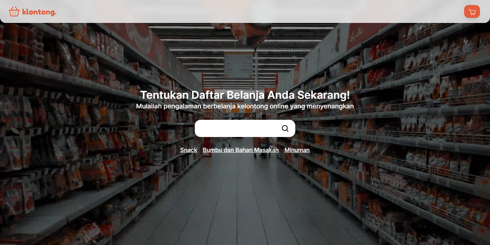
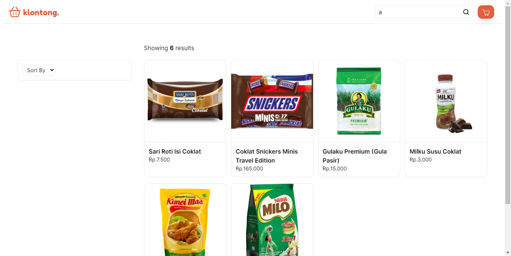
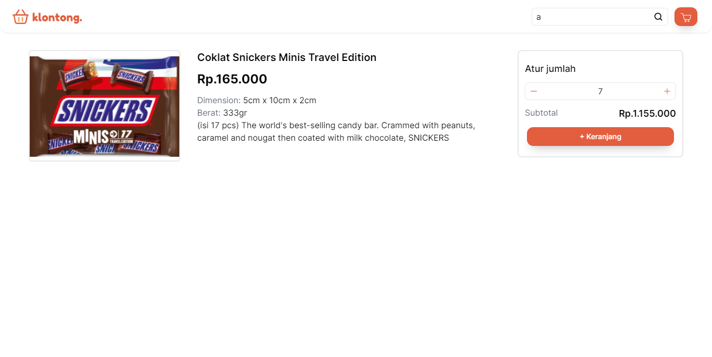
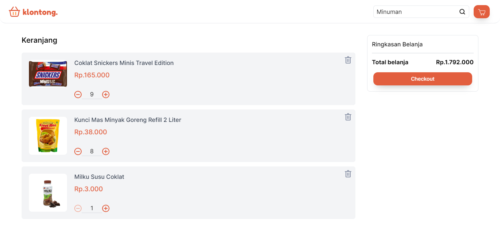

<div align="center">


<br>

[](#tech-stack)

<h3 align="center"><b>klontong.</b> - Example App</h3>
   <p align="center">
   Open Source. Front-end.
   </p>

[Demo](https://klontong-vue.vercel.app/) · [Related Projects](#related-projects) · [Request Feature](#report-bug)

</div>

## Table of Contents

- [Overview](#overview)
  - [Features](#features)
- [Tech Stack](#tech-stack)
- [Getting Started](#getting-started)
  - [Prerequisites](#prerequisites)
  - [Installation](#installation)
- [Screenshots](#screenshots)
- [Resources](#resources)
- [Related Projects](#related-projects)
- [License](#license)
- [Report Bug](#report-bug)

## Overview

Klontong: Your Ultimate Shopping Companion. Shop groceries, household essentials, and more with ease. 

Explore a wide range of products, enjoy exclusive deals, and convenient delivery options. Simplify your shopping experience with Klontong's user-friendly app!

Build using create vue app.

You can build it by yourself

### Features

- Products (Search, Sort, Filter)
- Cart
- etc.

## Tech Stack

- [Vue](https://vuejs.org/) & [Vue Router](https://router.vuejs.org/)
- [Vuex](https://vuex.vuejs.org/) & [vuex-persistedstate](https://www.npmjs.com/package/vuex-persistedstate) (Local Storage)
- [TailwindCSS](https://tailwindcss.com/)
- [Vercel](https://vercel.com/dashboard) for deploying demo
- etc.

## Getting Started

### Prerequisites

You need to install some software to run this project

- [Node.js](https://nodejs.org/en/download) (LTS version recommended, 14 or newer)

### Installation

1. Clone this repository to your local

   ```bash
   git clone https://github.com/nyannss/klontong-vue.git
   ```

2. Change current directory

   ```bash
   cd klontong-vue
   ```

3. Install dependencies

   If you using npm

   ```bash
   npm install
   ```

   If you using yarn

   ```bash
   yarn
   ```

4. Setup environment

   ```env
   VUE_APP_BACKEND_HOST = (your rest api host)
   ```

5. Start development server with watcher

   ```bash
   npm run serve
   ```

5. Build app

   ```bash
   npm run build
   ```

## Screenshots

<div style="display:flex;flex-wrap:wrap;gap:0.5rem">
 



</div>

## Resources

Special thanks for providing resources such as icons and images.

- [Layout Draw.io](https://drive.google.com/file/d/1kjvg5-mnyJhPrdcihtJwOnfFKa9LuWG_/view?usp=sharing)
- [Flaticon](https://flaticon.com/)
- [unDraw](https://undraw.co/)
- [SVGRepo](https://svgrepo.com/)
- [Ananthu Ganesh](https://unsplash.com/@ananthuganesh)
- [Tokopedia](https://tokopedia.com)
- and other sources.

If there are resources that belong to you, please let me know, I will write it here.

## Related Projects

- [klontong-express](https://github.com/nyannss/klontong-express) - Rest API

## License

This project is licensed under the ISC License. See the [LICENSE](LICENSE) file for details.

## Report Bug

Any error report you can pull request
or contact: <nyannss@proton.me>
